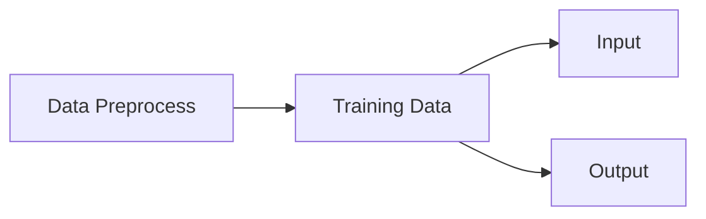

<h1>Stock Modeling</h1>



## Load Stock Data

* [Load stock data from internet](../src/stock01.py)
* [Plot, smooth and velocity](../src/stock02.py)

## Stock Data Analysis
*[Understand Bollinger band, MACD, Signal Lines](../src/stock03.py)


## Two Models

1. Classification (buy/sell) "Man Labeled"
2. Stock Price Forecast (price range/moving direction)

## Data Process
### Smooth Data
*[曲线平滑](../src/smooth.py)

### Classified Data Preparing
Need to do this because we have to generate buy/sell output based on stock data
* [Generate Data for Training ](../src/GenTrainingData.py)
* [csv file generated for training](../stockdata/SPY_TrainingData_30_13.csv)


6 columns for each buy/sell point
1. weekday
2. time
3. Close price
4. Volume
5. Velocity
6. Acceleration

window = 30 data points
input : 30*6 = 180
output : 2 (buy/sell)

[Data Preparation](../src/GenTrainingData.py)
[Generate Model](../src/stock04.py)


## Forecast Modeling

## Preparing Data


[Get data from database](../src/GenTrainTestDataBig_fixlen_GRU_2.py)
1. Databased File: data/stock_bigdata_2019-2023.db
2. outputs: data/SPX_TrainingData_FixLenGRU_120_604, SPX_TestingData_FixLenGRU_120_604, SPX_PredictData_FixLenGRU_120_604

**Sample training data for one row**
```Sample training data for one row
[(4, 21.8, 0.5100983020554315, -0.043967828418245536, -0.13386952636278154), (4, 21.816666666666666, 0.5579982126899297, 0.047899910634498166, 0.0918677390527437), (4, 21.833333333333332, 0.6010723860590046, 0.04307417336907493, -0.0048257372654232356), (4, 21.85, 0.555853440572018, -0.04521894548698657, -0.0882931188560615), (4, 21.866666666666667, 0.5117068811439058, -0.044146559428112186, 0.001072386058874386), (4, 21.883333333333333, 0.5567470956210259, 0.04504021447712003, 0.08918677390523222), (4, 21.9, 0.5529937444146399, -0.0037533512063859797, -0.04879356568350601), (4, 21.916666666666668, 0.5517426273458987, -0.0012511170687411477, 0.002502234137644832), (4, 21.933333333333334, 0.6420017873101679, 0.09025915996426914, 0.09151027703301029), (4, 21.95, 0.6505808757819771, 0.008579088471809215, -0.08168007149245993), (4, 21.966666666666665, 0.6443252904379462, -0.006255585344030923, -0.014834673815840138), (4, 21.983333333333334, 0.5992850759606636, -0.04504021447728257, -0.03878462913325165), (4, 22.0, 0.5556747095621514, -0.043610366398512235, 0.001429848078770335), (4, 22.016666666666666, 0.641465594280568, 0.08579088471841667, 0.1294012511169289), (4, 22.033333333333335, 0.6834673815907685, 0.042001787310200434, -0.04378909740821624), (4, 22.05, 0.7336907953530449, 0.05022341376227646, 0.008221626452076025), (4, 22.066666666666666, 0.8739946380697239, 0.14030384271667895, 0.09008042895440249), (4, 22.083333333333332, 1.0, 0.12600536193027612, -0.014298480786402834), (4, 22.1, 0.9097408400357309, -0.09025915996426914, -0.21626452189454526), (4, 22.116666666666667, 0.9092046470062936, -0.0005361930294373041, 0.08972296693483184), (4, 22.133333333333333, 0.8661304736372185, -0.04307417336907504, -0.04253798033963774), (4, 22.15, 0.8672028596960931, 0.0010723860588746081, 0.04414655942794965), (4, 22.166666666666668, 0.7774798927614237, -0.08972296693466941, -0.09079535299354402), (4, 22.183333333333334, 0.8216264521895358, 0.044146559428112075, 0.1338695263627815), (4, 22.2, 0.7764075067023867, -0.04521894548714911, -0.08936550491526118), (4, 22.233333333333334, 0.7322609472744371, -0.04414655942794954, 0.0010723860591995704), (4, 22.25, 0.8237712243074474, 0.09151027703301029, 0.13565683646095983), (4, 22.266666666666666, 0.7785522788202983, -0.04521894548714911, -0.1367292225201594), (4, 22.283333333333335, 0.7317247542448373, -0.04682752457546102, -0.0016085790883119122), (4, 22.3, 0.7801608579087727, 0.04843610366393536, 0.09526362823939638), (4, 22.316666666666666, 0.692582663092015, -0.08757819481675766, -0.13601429848069302), (4, 22.333333333333332, 0.6932975871313188, 0.0007149240393038436, 0.0882931188560615), (4, 22.35, 0.6956210902590971, 0.0023235031277782925, 0.0016085790884744489), (4, 22.366666666666667, 0.6514745308311476, -0.04414655942794954, -0.04647006255572783), (4, 22.383333333333333, 0.6974084003574381, 0.04593386952629053, 0.09008042895424007), (4, 22.4, 0.7403038427166464, 0.04289544235920828, -0.003038427167082247), (4, 22.416666666666668, 0.7376228775692976, -0.002680965147348835, -0.045576407506557115), (4, 22.433333333333334, 0.7385165326184681, 0.0008936550491704942, 0.003574620196519329), (4, 22.45, 0.7385165326184681, 0.0, -0.0008936550491704942), (4, 22.466666666666665, 0.694369973190356, -0.044146559428112075, -0.044146559428112075), (4, 22.483333333333334, 0.6487935656836361, -0.045576407506719874, -0.0014298480786077983), (4, 22.5, 0.7352993744415193, 0.08650580875788316, 0.13208221626460304), (4, 22.516666666666666, 0.6480786416443322, -0.08722073279718712, -0.17372654155507028), (4, 22.533333333333335, 0.8255585344057884, 0.17747989276145626, 0.2647006255586434), (4, 22.55, 0.8260947274352257, 0.0005361930294373041, -0.17694369973201896), (4, 22.583333333333332, 0.7837354781054546, -0.04235924932977109, -0.04289544235920839), (4, 22.6, 0.7374441465594309, -0.04629133154602372, -0.00393208221625263), (4, 22.616666666666667, 0.7376228775692976, 0.00017873100986665058, 0.04647006255589037), (4, 22.633333333333333, 0.7374441465594309, -0.00017873100986665058, -0.00035746201973330116), (4, 22.65, 0.7470956210902772, 0.009651474530846249, 0.0098302055407129), (4, 22.666666666666668, 0.7024128686327278, -0.04468275245754938, -0.05433422698839563), (4, 22.683333333333334, 0.7358355674709566, 0.03342269883822879, 0.07810545129577817), (4, 22.7, 0.7374441465594309, 0.0016085790884743378, -0.031814119749754455), (4, 22.716666666666665, 0.694369973190356, -0.04307417336907493, -0.04468275245754927), (4, 22.733333333333334, 0.7385165326184681, 0.044146559428112075, 0.087220732797187), (4, 22.75, 0.6504021447721104, -0.08811438784635761, -0.1322609472744697), (4, 22.766666666666666, 0.5159964253798918, -0.13440571939221868, -0.04629133154586107), (4, 22.783333333333335, 0.5154602323502919, -0.0005361930295998407, 0.13386952636261884), (4, 22.8, 0.5272564789990498, 0.011796246648757891, 0.012332439678357732), (4, 22.816666666666666, 0.5701519213584207, 0.04289544235937093, 0.031099195710613037), (4, 22.833333333333332, 0.5571045576407592, -0.013047363717661575, -0.0559428060770325), (4, 22.85, 0.5147453083109881, -0.04235924932977109, -0.02931188561210951), (4, 22.866666666666667, 0.5594280607685373, 0.04468275245754927, 0.08704200178732036), (4, 22.883333333333333, 0.5254691689008714, -0.033958891867665986, -0.07864164432521525), (4, 22.916666666666668, 0.5701519213584207, 0.04468275245754938, 0.07864164432521537), (4, 22.95, 0.604647006255524, 0.03449508489710329, -0.01018766756044609), (4, 22.966666666666665, 0.5628239499553528, -0.041823056300171246, -0.07631814119727454), (4, 22.983333333333334, 0.5136729222519509, -0.04915102770340185, -0.007327971403230604), (4, 23.0, 0.5168900804288997, 0.0032171581769487867, 0.05236818588035064), (4, 23.016666666666666, 0.5594280607685373, 0.04253798033963763, 0.03932082216268884), (4, 23.033333333333335, 0.5136729222519509, -0.04575513851658641, -0.08829311885622404), (4, 23.05, 0.5136729222519509, 0.0, 0.04575513851658641), (4, 23.066666666666666, 0.6041108132260867, 0.09043789097413579, 0.09043789097413579), (4, 23.083333333333332, 0.6509383378015478, 0.04682752457546102, -0.04361036639867477), (4, 23.1, 0.5599642537979747, -0.0909740840035731, -0.13780160857903412), (4, 23.116666666666667, 0.5605004468275745, 0.0005361930295998407, 0.09151027703317294), (4, 23.133333333333333, 0.5605004468275745, 0.0, -0.0005361930295998407), (4, 23.15, 0.5159964253798918, -0.04450402144768273, -0.04450402144768273), (4, 23.166666666666668, 0.4282394995532674, -0.08775692582662437, -0.04325290437894164), (4, 23.183333333333334, 0.4825737265415005, 0.05433422698823309, 0.14209115281485746), (4, 23.2, 0.5192135835568406, 0.03663985701534006, -0.01769436997289303), (4, 23.216666666666665, 0.5594280607685373, 0.0402144772116968, 0.003574620196356737), (4, 23.233333333333334, 0.5610366398570118, 0.0016085790884744489, -0.03860589812322235), (4, 23.25, 0.5601429848078413, -0.0008936550491704942, -0.002502234137644943), (4, 23.283333333333335, 0.4825737265415005, -0.07756925826634081, -0.07667560321717032), (4, 23.3, 0.5612153708668783, 0.07864164432537785, 0.15621090259171866), (4, 23.316666666666666, 0.5638963360143898, 0.0026809651475114826, -0.07596067917786636), (4, 23.333333333333332, 0.5599642537979747, -0.003932082216415167, -0.00661304736392665), (4, 23.35, 0.5628239499553528, 0.002859696157378133, 0.0067917783737933), (4, 23.366666666666667, 0.47077747989274255, -0.09204647006261024, -0.09490616621998837), (4, 23.383333333333333, 0.4729222520108168, 0.002144772118074234, 0.09419124218068448), (4, 23.416666666666668, 0.4825737265415005, 0.009651474530683712, 0.007506702412609478), (4, 23.433333333333334, 0.5192135835568406, 0.03663985701534006, 0.026988382484656348), (4, 23.45, 0.4713136729223424, -0.047899910634498166, -0.08453976764983823), (4, 23.466666666666665, 0.5159964253798918, 0.04468275245754938, 0.09258266309204755), (4, 23.5, 0.4305630026810457, -0.08543342269884607, -0.13011617515639545), (4, 23.516666666666666, 0.5172475424486329, 0.08668453976758722, 0.1721179624664333), (4, 23.533333333333335, 0.49454870420012503, -0.02269883824850788, -0.1093833780160951), (4, 23.55, 0.20911528150134398, -0.285433422698781, -0.26273458445027315), (4, 23.566666666666666, 0.12100089365514897, -0.088114387846195, 0.197319034852586), (4, 23.583333333333332, 0.031099195710450448, -0.08990169794469853, -0.001787310098503525), (4, 23.6, 0.0, -0.031099195710450448, 0.058802502234248086), (4, 23.616666666666667, 0.03306523681865804, 0.03306523681865804, 0.06416443252910849), (4, 23.633333333333333, 0.07613941018773301, 0.04307417336907497, 0.01000893655041693), (4, 23.65, 0.07560321715813319, -0.0005361930295998268, -0.0436103663986748), (4, 23.666666666666668, 0.07453083109925863, -0.0010723860588745526, -0.0005361930292747258), (4, 23.683333333333334, 0.12243074173375675, 0.04789991063449811, 0.04897229669337266), (4, 23.7, 0.12082216264528237, -0.0016085790884743795, -0.04950848972297249), (4, 23.716666666666665, 0.12082216264528237, 0.0, 0.0016085790884743795), (4, 23.733333333333334, 0.12260947274362335, 0.0017873100983409884, 0.0017873100983409884), (4, 23.75, 0.07971403038425244, -0.042895442359370914, -0.0446827524577119), (4, 23.766666666666666, 0.12260947274362335, 0.042895442359370914, 0.08579088471874183), (4, 23.783333333333335, 0.12207327971402353, -0.0005361930295998268, -0.04343163538897074), (4, 23.8, 0.17694369973185642, 0.05487042001783289, 0.05540661304743272), (4, 23.816666666666666, 0.21197497765872206, 0.03503127792686564, -0.01983914209096725), (4, 23.833333333333332, 0.16621983914213562, -0.04575513851658644, -0.08078641644345208), (4, 23.85, 0.14459338695266483, -0.02162645218947079, 0.02412868632711565), (4, 23.866666666666667, 0.2103663985702477, 0.06577301161758287, 0.08739946380705366), (4, 23.883333333333333, 0.25451295799819723, 0.04414655942794954, -0.021626452189633327), (4, 23.9, 0.21251117068815933, -0.0420017873100379, -0.08614834673798744)][0.17694369973185642, 0.17068811438782552, 0.16907953529935113]

```
For above: 5 data as one group in each ()
1. Weekday
2. Time
3. Close Price
4. Velocity
5. Acceleration

```py
   #Trainning Data Length
    # average number of working days in a month is 21.7, based on a five-day workweek
    # so 45 days is total for two months working days
    # 200 days is one year working days
    traintest_data_len = 120
    target_len = 3
```
**trainingtest_data_len** = 120, means total of 120 groups of 5 data in each point
**target_len** = 3, means total output include 3 future close prices (For this program, the time is 1 minute between each close price), output is on the end of each row

A total of 9364 rows or groups of training data

Normalized data include velocuty, acceleration, and output

### Create a GRU model
[GRU Model website](https://d2l.ai/chapter_recurrent-modern/gru.html)

[Generate GRU Model and save to File](../src/Test_GRUX3_fixlen_01.py)
Output Model saved to: outputs/GRU_model_with_fixed_length_data_610.pth


### Forecast Future Stock Price Range
[Forecast Future Stock Normalized Price Range](../src/Test_GRUX3_fixlen_01_predict.py)

### Determine Accuracy
[R Squared from CHATGPT](R2.md)

## Available Models
[Available Models](models.md)

## Activate Functions


## Loss Functions
[Loss Functions](loss.md)

## Optimizer Functions
[Optimizer](optimizer.md)
