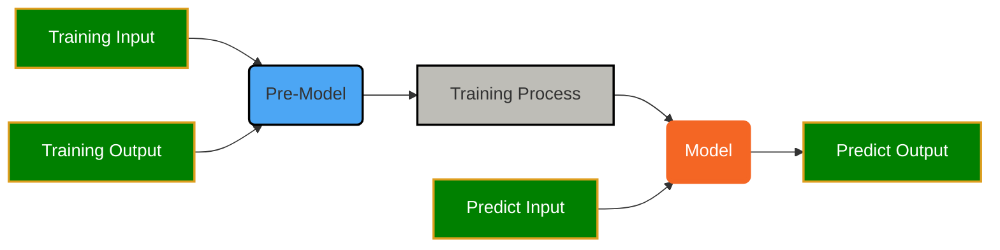
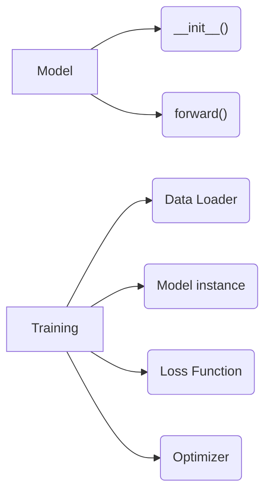
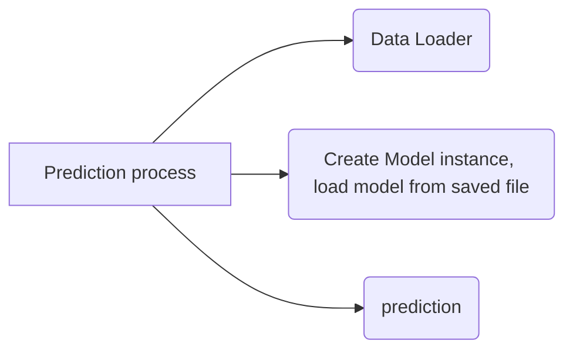

<h1>Machine Learning Notes</h1>

6/12:2h, 6/19:2h, 7/3:1h

WFD: write Fucking ducument

## Getting Started
! python interpreter not installed
1. download python from internet, 
2. install it on c:\Users\rodney\.Appdata\program\python
3. setup path (Edit System Environment)
4. python extension for VS Code

! markdown preview does not work properly
markdown preview extension (Yiyi Wang, Yu Zhang)

### create local python evironment

```dos
python -m venv env
```
run the command above and close the terminal and open it again as command prompt

```output
Microsoft Windows [Version 10.0.22631.3737]
(c) Microsoft Corporation. All rights reserved.

(env) C:\Users\wangq\workspace\students\rodney\torch>
```
as you can see, the (env) is added before the prompt, very important

### install matplotlib and pandas on local

```
pip install matplotlib
pip install pandas
pip install torch
pip install numpy
```

## What is Machine Learning

✔️😄 by given experiment data(input/output) as training data, create a model, and then use the model to predict real output from input.

1. I have expement data
2. create model
3. predict future

[ML definition from ChatGPT](ml.md)

* [Generate linear data based on function and noise](../src/genLinear.py)
  $$y=f(x)=3 \cdot x - 7 + noise$$
* [plot linear data chart](../src/plotLinear.py)
* [create linear model](../src/linearModel.py)
  


👍😄 **Conclusion**
1. lr is learning rate, which can be adjusted
2. epoch can ba adjusted (number of training times), big effects on model
3. model cannot be exactly match with original function
4. the accuracy depends on accuracy of experiment data


### What is a model?

just by watch the chart, we think it is probabaly a line, so we create a model like

$$ y = wx+b$$ as a model. where w: weight, b: bias



## Basic Knowledge
❓What is Matrix?
[document from ChatGPT](matrix.md)
[鸡兔同笼](../src/chickensRabbits.py)


❓What is Mean Square Error?
[Understand Mean Square Error, math](mse1.md)

❓What is gradient of MSE in matrix format?
[Understand Mean Square Error, math where theta include both w, b](mse1.md)
[Understand Learning Rate](../src/mse1.py)
[Understand how to adjust w & b](../src/mse2.py)


❓What is Learning Rate in NN? Why it is so sentive?
[adjust learning rate can find different grad=0 point](../src/learningRate.py)
adjust initial x0, and learning Rate, epsilone

## Digit Handwritting Classification

```install module torchvision for digits01.py
(env) C:\Users\wangq\workspace\students\rodney\torch>pip install torchvision
```
* [Understand training process, and save model to a file](../src/digits01.py)




* [load modle from file and predict handwritting](../src/digits02.py)

